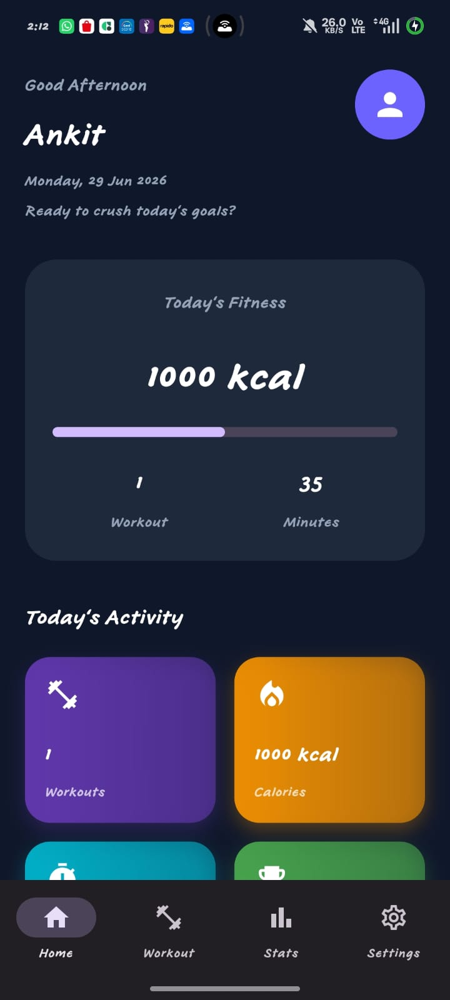
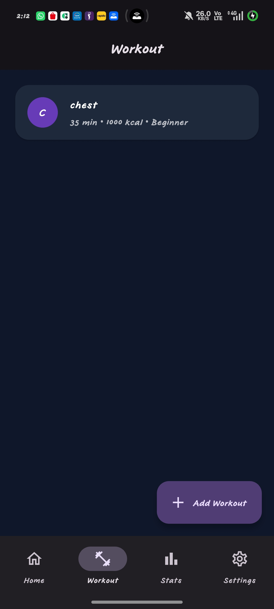
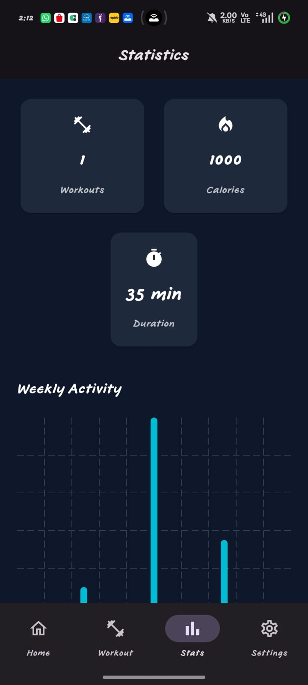
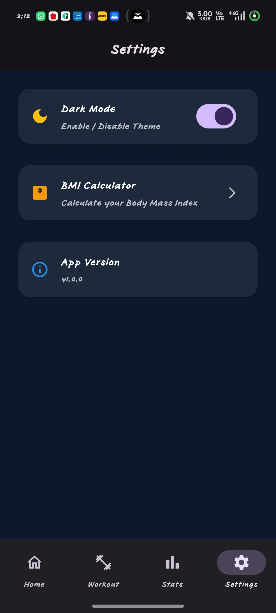

# 💪 FitPulse – Fitness Tracker App

A modern Flutter-based Fitness Tracker application developed as part of the **CodeAlpha Flutter Development Internship**.

FitPulse helps users track workouts, monitor daily water intake, calculate BMI, and view fitness statistics with a clean and modern UI.

---

## 📱 Features

- 🏋️ Workout Tracker
- 💧 Daily Water Intake Tracker
- 📊 Fitness Statistics Dashboard
- ⚖️ BMI Calculator
- 🌙 Dark & Light Theme
- 🔔 Local Notifications
- 💾 SQLite Local Database
- 🎨 Modern UI Design
- 🚀 Animated Splash Screen
- 📱 Responsive Layout

---

## 📸 Screenshots

| Splash | Home | Workout |
|--------|------|---------|
|  |  |  |

| Water | Statistics | BMI |
|-------|------------|-----|
|  |  |  |

| Settings |
|----------|
|  |

> Replace the screenshot filenames if your images have different names.

---

## 🛠 Tech Stack

- Flutter
- Dart
- SQLite
- Provider
- Shared Preferences
- Flutter Local Notifications
- FL Chart

---

## 📂 Project Structure

```
lib/
│
├── core/
├── database/
├── models/
├── providers/
├── screens/
├── services/
├── widgets/
└── main.dart
```

---

## 📦 Packages Used

```yaml
provider
sqflite
shared_preferences
fl_chart
flutter_local_notifications
google_fonts
intl
path
percent_indicator
```

---
## 📥 APK

The release APK is available in:

build/app/outputs/flutter-apk/app-release.apk


## 🚀 Installation

```bash
git clone https://github.com/ankitbhardwaj2710/codealpha_fitness_tracker.git

cd codealpha_fitness_tracker

flutter pub get

flutter run
```

---

## 🎯 Future Improvements

- 👣 Real-time Step Counter
- ❤️ Heart Rate Monitoring
- ☁️ Firebase Cloud Sync
- 🔐 Authentication
- 🏆 Achievement System
- 📅 Workout Planner
- 📈 Weekly & Monthly Reports
- 🔄 Google Fit / Health Connect Integration

---

## 👨‍💻 Developer

**Ankit Bhardwaj**

- Flutter Developer
- Frontend Developer
- AI/ML Student

LinkedIn:

www.linkedin.com/in/ankit-bhardwaj-612b34334

GitHub:
https://github.com/ankitbhardwaj2710

---

## ⭐ Support

If you like this project, don't forget to ⭐ star the repository.